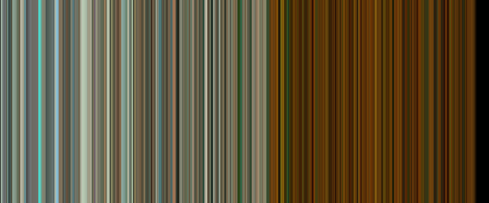

# Video Verticalizer

Create artwork from your video files! This script reads in a video file and create a vertical line for each frame based
on the average color of the frame. When stacked together, the lines produce amazing artwork!

<p style="text-align: center">
<a href="https://www.youtube.com/watch?v=kJQP7kiw5Fk&list=PLirAqAtl_h2r5g8xGajEwdXd3x1sZh8hC&index=2&t=0s">
    
</a>
</p>

## Installation

Clone the repository:

```bash
# Cone reposotory with SSH...
$ git clone git@github.com:mlnotebook/video_verticalizer.git
# ... or with HTTPS
$ git clone https://github.com/mlnotebook/video_verticalizer.git
```

Change to the directory and create a Python virtual environment and install the required packages:

```bash
$ cd ./video_verticalizer
$ python -m venv ./venv
$ source ./venv/bin/activate # venv\Scripts\activate on Windows
$ pip install -r ./requirements.txt
```

## Configuration

Your config file `./video_verticalizer/config.cfg` needs to be edited for the videos you'd like to verticalize.
There are two sections:

**Note**: this is a `.cfg` file. Do not include quotations around values, i.e. `video.mp4` not `'video.mp4'`.

### `['CONFIG']` section

This section contains a number of variables that can be modified:
* `canvas_height`: (int) height of the canvas during the verticalization process. (This doesn't really matter as the 
canvas is resized at the end of the process). Default: `500`
* `canvas_width`: (int) width of the canvas during verticalization process. This determines how many frames are taken
from the video file. A higher number here will give a more fine-grain account of the video file, but the resulting image
 will be longer. If this width is wider than the number of frames in the video file, the vertical line width is
increased to fit the canvas size. Default: `1200`
* `crop_ratio`: (float) the fraction of the frame to use when calculating the average color. `1.0` is the full image 
but this contains a lot of background and may result in dull images. Default: `0.67`
* `show_progress`: (bool) whether to display the result of the verticalization process as it occurs 
(pretty cool to watch!). Default: `1`
* `video_root`: (str) path to the directory where the video files are stored.
* `final_height`: (int) after verticalization, the canvas is resized to this height. Nearest neighbour interpolation is 
used to make sure that the lines stay crisp. Default: `1000`
* `final_width`: (int) after verticalization, the canvas is resized to this width. Nearest neighbour interpolation is 
used to make sure that the lines stay crisp. Default: `2400`
* `output_root`: (str) path to the directory where the output should be stored. Default: `./`
* `output_format`: (str) the format of the output image file. Default: `.png`

### `['movie']` section

Each video file you want to process should have its own `['movie']` section:
* `['movie_name']`: (str) replace `movie_name` with a unique identified for the video file.
* `filename`: (str) the name of the video file including extension.
* `start_time`: (int/float) the time **in seconds** at which the video capture should start. `0` begins at the start.
* `end_time`: (int/float) the time **in seconds** at which the video captiure should end. `-1` ends at the end.

Example:
```bash
[despacito]
filename=despacito.mp4
start_time=0
end_time=-1
```

## Usage

To being the verticalization process, run:

```bash
$ python ./video_verticalizer.py
```

The terminal will show the progress through the movie using a `tqdm` progress bar. Key stats are also presented about 
the video file. Output is saved into the configured output directory with the `crop_ratio` appended to the directory 
name. Press `q` on the live frame to stop the process (or `ctrl + c` on the terminal).

With some videos (particular youtube videos) you may see warnings like:
```
h264 @ 000002354c499640] mmco: unref short failure
```

These can be safely ignored and the process will still complete successfully.